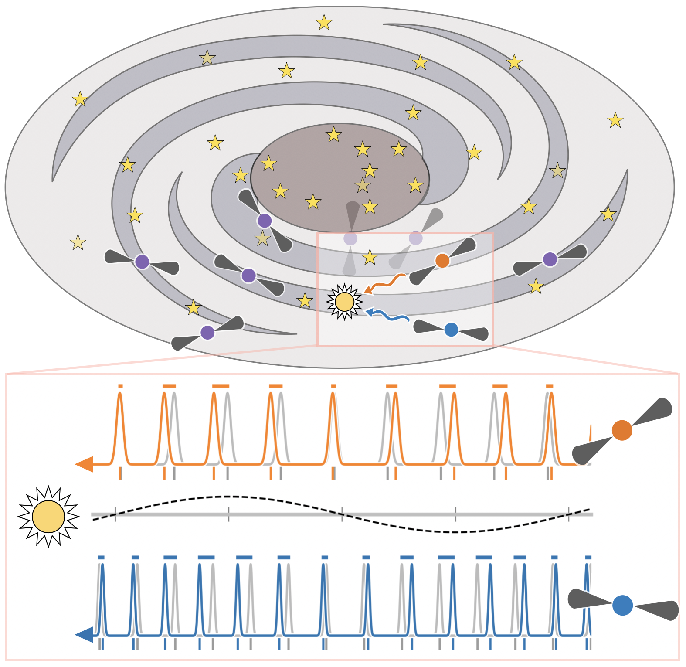
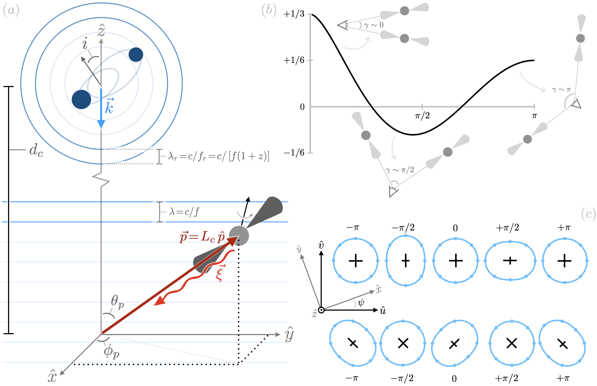
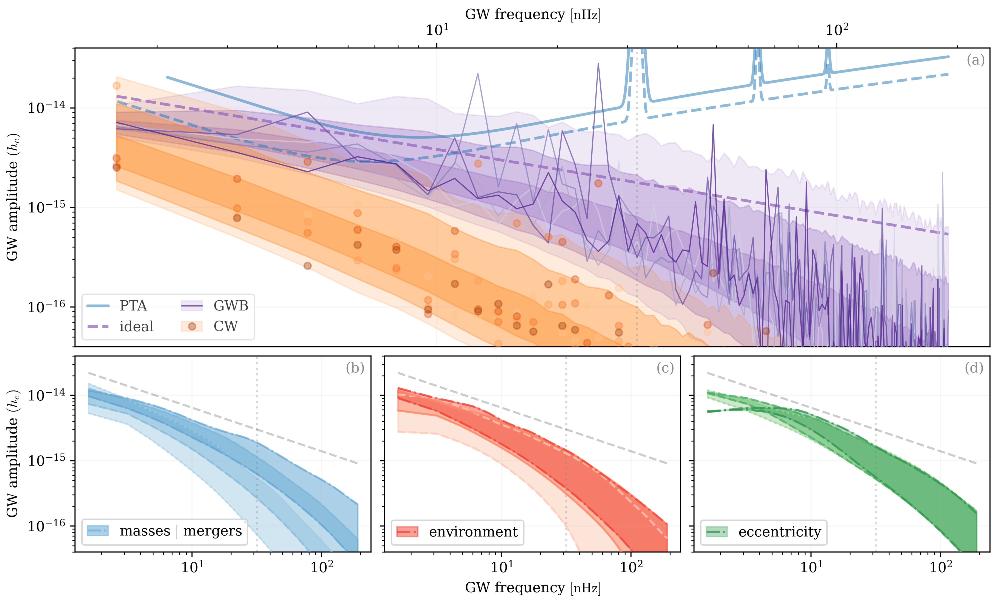
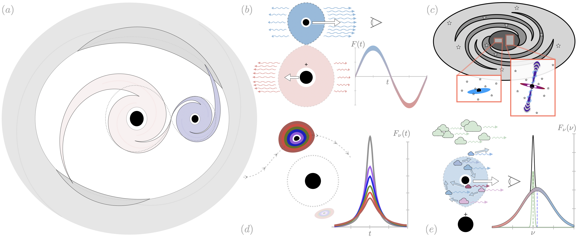

# Pulsar Timing Arrays

Luke Zoltan Kelley  
LZKelley@berkeley.edu  

This is a pre-print of a chapter for the *Encyclopedia of Astrophysics* (edited by **Ilya Mandel**, section editor **Jeff Andrews**) to be published by *Elsevier* as a Reference Module.

The intention of this article is to act as an overview and concise guide to pulsar timing arrays and their primary sources of interest: supermassive black hole binaries.  The intent is **not** to provide a comprehensive review of the literature and, further, the number of citations was required to be *significantly* limited.  I also hoped the article would act as a convenient `cheat-sheet' for frequently-used equations, however this became increasingly outside of the scope of the article.  Perhaps extracting the equations, and expanding them further, would be a useful addition.

I apologize to my colleagues for not better availing myself of their expertise in the writing of this article, many of whom would have been far better suited to author it!  Still, comments and suggestions are absolutely most welcome.  Please reach out, or even better: submit a pull request or issue, for any errors.  

**Compiling**: The `build.sh` script in the repository home directory can be used to compile the latex into a PDF which is copied into the home directory.

**Contributing**: comments/suggestions/improvements are all **very welcome**.  Please feel free to make contributions by:
* Adding 'issues' or 'pull requests' to [the github](https://github.com/lzkelley/ptas-encyclopedia),
* Editing [the overleaf](https://www.overleaf.com/project/67ab8c4d6a79b09f7882bec9) [NOTE: e-mail me to get edit access],
* e-mailing suggestions to me directly.

## Figures

The schematics were made using Apple Keynote, and the source files are included in the `schematics/` directory.  The GWB schematic was made using a not-entirely-physical toy model, primarily for computational expediency.  Figures may be modified and used with acknowledgement.  

<!--  -->

<!--  -->

<!--  -->

<!--  -->

